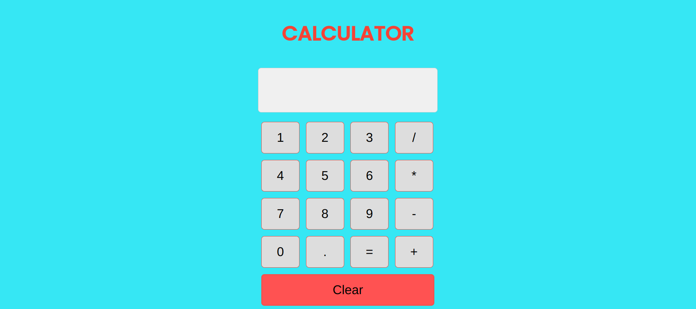

# React Calculator

> This project involves the essentials of a simple calculator in React. Basic Calculations.

## Screenshot



## Technologies

- JavaScript
- HTML5
- CSS3
- VSC code
- React


## Set up

1. npm create vite@latest
2. npm i
3. npm run dev to open the server
4. create .prettierrc
5. npm run format
6. npm install -g prettier


## Code Examples

```React
const App = () => {
    const [value, setValue] = useState('');
    const btnValues = [
        [1, 2, 3, '/'],
        [4, 5, 6, '*'],
        [7, 8, 9, '-'],
        [0, '.', '=', '+'],
        ['Clear']
    ];
```

## Features

- Basic Arithmetic Operations: Addition, Subtraction, Multiplication, and Division.
- Clear Function: Ability to clear the display.
- Display: Shows current input and result.